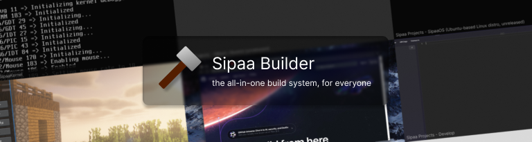

A builder wrote in C# to build apps for everything, on everything, with everything.

## Features

* TODO: Dependency Manager (manage project dependencies)
* project.json file to manage your project
* Plugins, to extend the functionnality of the builder

## History

Sipaa Builder used to be 'sk-build', a tool exclusively to compile our kernel, SipaaKernel.
At Christmas 2023, i made the decision to make Sipaa Builder for all projects. (TODO: make it better)
